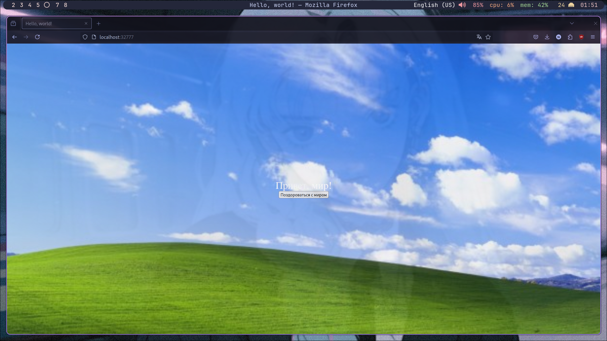
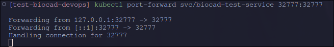
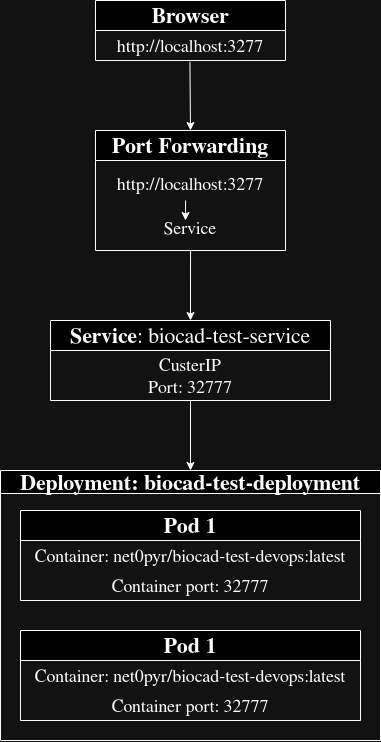

# Практическое задание отбора на стажировку DevOps Biocad

## Автор: Зыков Иван

## Запуск Docker образа

```bash
docker run net0pyr/biocad-test-devops:latest
```

## Развертывание приложения в minikube

```bash
kubectl apply -f minikube/deployment.yaml # применяем манифест для запуска подов
kubectl apply -f minikube/service.yaml # применяем манифест для поднятия service
kubectl port-forward svc/biocad-test-service 32777:32777 & # прокидываем порты, для доступа по адреса http://localhost:32777
```

## Результат




## Схема организации контейнеров и сервисов


